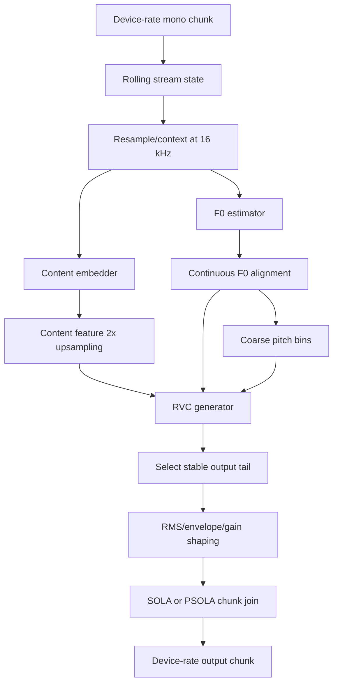

# Architecture

## Purpose

This document describes the conceptual architecture of `vc-rs`: how audio moves
through the realtime engine, how the RVC pipeline is staged, and why chunk
smoothing is separated from the audio callback. Concrete commands, local model
paths, and smoke-test recipes belong in `README.md` or local scripts instead.

The current design is a CLI-first Rust implementation of realtime RVC voice
conversion. The same engine and model pipeline should remain reusable by a
future GUI; the GUI should configure the engine, not own audio or inference
logic.

## Module Boundaries

- `cli`: user-facing arguments and validation.
- `audio`: device enumeration and CPAL/WASAPI stream setup.
- `engine`: realtime stream orchestration, bounded queues, worker thread,
  metrics, and WAV-mode reuse of the same model path.
- `model_rvc`: ONNX Runtime sessions, streaming RVC state, feature extraction,
  F0 extraction, pitch preparation, and output level shaping.
- `sola`: chunk joining and model-output preparation using SOLA or PSOLA.
- `dsp`: resampling, sample conversion, RMS/envelope operations, correlation,
  and crossfade primitives.

Changes to chunk sizing, model context, smoothing, or output latency usually
cross `engine`, `model_rvc`, `sola`, and `dsp`; review them together.

## Realtime Topology

```mermaid
flowchart LR
    mic["Input device"] --> in_cb["Input audio callback"]
    in_cb --> in_ring["Input ring buffer"]
    in_ring --> worker["Worker thread"]
    worker --> model["RVC pipeline"]
    model --> smooth["SOLA / PSOLA smoother"]
    smooth --> out_ring["Output ring buffer"]
    out_ring --> out_cb["Output audio callback"]
    out_cb --> speaker["Output device"]
```

The audio callbacks are intentionally small. They move samples through bounded
ring buffers and emit silence on underrun; they do not run ONNX inference,
perform chunk smoothing, write files, or log directly. Anything that can block,
allocate heavily, or take model-scale CPU/GPU time is kept on the worker side.

The worker owns chunk accumulation, model inference, output smoothing,
resampling back to the device rate, and metrics updates. If inference falls
behind, bounded queues make the failure mode explicit: input overrun drops new
input samples, output underrun emits silence, and output overflow drops newly
produced samples rather than blocking the realtime callback.

## Chunk Lifecycle

Realtime audio arrives in device callback-sized blocks, but the model operates
on larger logical chunks. The worker accumulates input samples until one model
chunk is available, then sends that chunk through the RVC pipeline.

The RVC pipeline does not treat each chunk as isolated audio. It keeps streaming
state for recent input, 16 kHz resampled audio, content features, and F0 frames.
Each inference window includes the current chunk plus enough recent context and
extra output allowance for smoothing. The model output is then trimmed to the
tail that corresponds to the current chunk and the smoother search window.

This lifecycle preserves three invariants:

- The output smoother emits a fixed number of device-rate samples per input
  chunk.
- Feature frames, continuous F0, coarse pitch, and model output must refer to
  the same time window.
- The realtime callback sees only queued samples, never model-domain state.

## RVC Pipeline

Conceptually, RVC conversion has three model-facing inputs:

- Content features describe what is being spoken while discarding much of the
  source speaker identity.
- F0/pitch describes the melody of voiced speech and supports pitch shifting.
- Speaker/model conditioning selects the target voice inside the RVC model.

The content embedder and F0 estimator operate on the same 16 kHz context window.
Content features are upsampled by repeating each frame twice, matching the RVC
pipeline convention that expands the content-feature frame rate before
generation. F0 is then length-matched to the resulting feature frame count and
kept both as continuous `pitchf` and quantized coarse pitch. Misaligning these
streams usually sounds like timing drift, pitch lag, or unstable consonants, so
frame-grid changes should be treated as audio-quality changes, not cleanup.

After generation, the output may be shaped by volume envelope, RMS mixing, and
manual or automatic gain. These operations happen before chunk joining so the
smoother compares and crossfades audio at the level that will actually be
played.

## SOLA

SOLA, Similarity Overlap-Add, is used to hide discontinuities between
independently generated chunks. Even when two chunks represent adjacent input
audio, the generated waveform can be shifted by a few samples at the boundary.
Naively concatenating those chunks can produce clicks, combing, or a rough
phasiness.

The smoother keeps a short tail from the previous emitted chunk as a reference.
For the next generated candidate, the worker asks the model for extra samples
around the boundary. SOLA searches within that extra range for the offset whose
overlap is most similar to the reference, cuts the candidate at that offset, and
crossfades the overlap. The emitted chunk length stays fixed; only the boundary
position inside the candidate moves.

SOLA must stay on the worker side. It needs model-output history, extra model
samples, correlation search, and crossfade buffers. Moving it into the audio
callback would put search work and allocation pressure on the realtime path.

## PSOLA

PSOLA, Pitch-Synchronous Overlap-Add, is the pitch-aware variant used here when
the current output has stable voiced F0. Instead of accepting any high-similarity
offset, it estimates the current pitch period from `pitchf` and prefers offsets
that align the overlap near pitch-period boundaries.

This is useful for sustained vowels and other voiced regions, where a boundary
that cuts across the waveform period can sound unstable even if the generic
SOLA score is acceptable. When F0 is missing, unvoiced, too unstable, or outside
the supported range, PSOLA falls back to normal SOLA. That fallback is important:
forcing pitch-synchronous alignment on noisy consonants or silence usually makes
the boundary worse.

## Latency Trade-offs

End-to-end latency is the sum of device buffering, input chunk accumulation,
model inference time, smoothing/search allowance, output buffering, and any
resampling delay. Reducing one term often increases pressure elsewhere.

Smaller chunks reduce chunking latency but increase scheduling overhead and make
the model pipeline more sensitive to inference spikes. Larger chunks are easier
for the model and smoother but add startup and interactive latency. Extra model
output gives SOLA/PSOLA more room to find a clean join, but it also increases
the amount of audio processed per chunk.

The architecture therefore treats latency-sensitive code as a boundary:
callbacks are realtime-safe sample movers, while the worker is the only place
that may spend time on inference, smoothing, diagnostics, and file-oriented
debug output.

## WAV Mode

WAV conversion uses the same RVC pipeline and smoother as realtime conversion
so audio-quality changes can be tested deterministically without device
scheduling noise. It can prime the smoother and handle the final tail explicitly
because it is not constrained by callback deadlines. A difference between WAV
and realtime output should usually be explained by buffering, scheduling, or
final-tail handling rather than by a separate model path.
