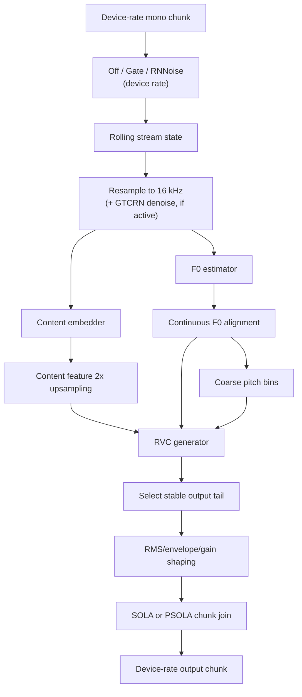

# Architecture

## Purpose

This document describes the conceptual architecture of `vc-rs`: how audio moves
through the realtime engine, how the RVC pipeline is staged, and why chunk
smoothing is separated from the audio callback. Concrete commands, local model
paths, and smoke-test recipes belong in `README.md` or local scripts instead.

CLI, GUI, VST3, and WAV conversion share the same audio-I/O-agnostic conversion
components wherever their hosting constraints permit. Front-ends adapt device,
host, or file I/O to those components; they should not own separate inference,
chunk-conversion, smoothing, or output-assembly implementations.

## Module Boundaries

- `vc-core`: shared audio-I/O-agnostic conversion components, including
  `RvcPipeline`, `ChunkConverter`, DSP, and SOLA/PSOLA smoothing.
- `vc-app`: shared standalone realtime runtime for CLI and GUI, including device
  I/O, bounded queues, worker orchestration, and metrics. The audio host is the
  `AudioHost` enum (cpal-`HostId`-aligned: `Wasapi`/`Asio`/`CoreAudio`/`Alsa`/`Jack`)
  and is chosen **per direction** (`input_host`/`output_host` in `RealtimeConfig`),
  so input and output may use different hosts — they are independent streams and
  clock domains, already resampled between by the engine. Every host except WASAPI
  *exclusive* goes through the shared cpal stream path (they differ only by which
  cpal host the device comes from); WASAPI exclusive uses the bespoke `wasapi_audio`
  path until cpal gains exclusive mode. Hosts unavailable on the running
  platform/build (e.g. ASIO without the `asio` feature) error at open time. cpal
  loads a single ASIO driver globally, so ASIO-on-both-directions shares one driver.
- `vc-cli`: CLI arguments, validation, realtime runtime control, and WAV file
  adaptation to the shared conversion components.
- `vc-gui`: GUI state and controls that configure the `vc-app` runtime.
- `vc-vst3`: DAW host adaptation, audio-callback ring-buffer I/O, worker
  scheduling, plugin state, and host latency reporting.

Changes to chunk sizing, model context, smoothing, or output latency usually
cross the front-end worker runtimes, `model_rvc`, `sola`, and `dsp`; review them
together.

## Shared Conversion Paths

All conversion modes should use the shared `vc-core` model and chunk-conversion
components. Inference, model streaming state, output shaping, and SOLA/PSOLA
joining must not be reimplemented in a front-end merely because its audio source
or scheduler differs.

CLI and GUI additionally share `vc-app` because both own standalone audio
devices. VST3 cannot use that device runtime because the DAW owns its audio
callback and requires plugin-specific state and latency reporting. VST3 should
still adapt host audio to the shared conversion components and keep its distinct
worker and buffering behavior narrowly scoped to host integration.

WAV conversion is an offline adapter around the same `RvcPipeline` and
`ChunkConverter` path used for realtime conversion. Offline processing may use
different scheduling, prime the smoother, pad a partial input chunk, and collect
the final tail explicitly. Those differences must not become a separate model,
chunk-conversion, smoothing, or output-shaping path.

When a hosting constraint requires a front-end-specific behavior, document the
constraint near the implementation and preserve the shared path for all
unaffected stages.

## Realtime Topology

```mermaid
flowchart LR
    mic["Input device"] --> in_cb["Input audio callback"]
    in_cb --> in_ring["Input ring buffer"]
    in_ring --> worker["Worker thread"]
    worker --> model["RVC pipeline"]
    model --> smooth["SOLA / PSOLA smoother"]
    smooth --> out_ring["Output ring buffer"]
    out_ring --> out_cb["Output audio callback"]
    out_cb --> speaker["Output device"]
```

The audio callbacks are intentionally small. They move samples through bounded
ring buffers and emit silence on underrun; they do not run ONNX inference,
perform chunk smoothing, write files, or log directly. Anything that can block,
allocate heavily, or take model-scale CPU/GPU time is kept on the worker side.

The threads carrying those callbacks run at OS real-time priority. The bespoke
WASAPI path and the worker self-boost via `thread-priority`; the cpal-driven
paths (WASAPI-shared, ASIO, …) get the same treatment from cpal's `realtime`
feature (enabled on the `cpal` dependency in `vc-app`), which promotes its
internal stream threads — Windows MMCSS "Pro Audio", else
`THREAD_PRIORITY_TIME_CRITICAL`. This pulls `audio_thread_priority` (MPL-2.0),
allowed crate-scoped in `deny.toml` since it ships unmodified and statically
linked.

The worker owns chunk accumulation, model inference, output smoothing,
resampling back to the device rate, and metrics updates. If inference falls
behind, bounded queues make the failure mode explicit: input overrun drops new
input samples, output underrun emits silence, and output overflow drops newly
produced samples rather than blocking the realtime callback.

Standalone sessions with a complete model set keep both RVC and passthrough
routes available on the worker. The live passthrough flag is sampled once per
input chunk. Passthrough stops invoking RVC inference and applies input gain,
the configured input denoiser, device-rate resampling, and output gain. When
conversion resumes, the worker clears stale RVC rolling context and smoother
history before processing the next chunk. Model-free sessions expose only the
passthrough route.

## Chunk Lifecycle

Realtime audio arrives in device callback-sized blocks, but the model operates
on larger logical chunks. The worker accumulates input samples until one model
chunk is available, then sends that chunk through the RVC pipeline.

The RVC pipeline does not treat each chunk as isolated audio. It keeps streaming
state for recent input, 16 kHz resampled audio, content features, and F0 frames.
Each inference window includes the current chunk plus enough recent context and
extra output allowance for smoothing. The model output is then trimmed to the
tail that corresponds to the current chunk and the smoother search window.

This lifecycle preserves three invariants:

- The output smoother emits a fixed number of device-rate samples per input
  chunk.
- Feature frames, continuous F0, coarse pitch, and model output must refer to
  the same time window.
- The realtime callback sees only queued samples, never model-domain state.

## RVC Pipeline

```mermaid
flowchart TD
    input["Device-rate mono chunk"] --> denoise["Off / Gate / RNNoise<br/>(device rate)"]
    denoise --> state["Rolling stream state"]
    state --> resample["Resample to 16 kHz<br/>(+ GTCRN denoise, if active)"]
    resample --> embed["Content embedder"]
    resample --> f0["F0 estimator"]
    embed --> feats["Content feature 2x upsampling"]
    f0 --> pitchf["Continuous F0 alignment"]
    pitchf --> coarse["Coarse pitch bins"]
    feats --> rvc["RVC generator"]
    pitchf --> rvc
    coarse --> rvc
    rvc --> tail["Select stable output tail"]
    tail --> level["RMS/envelope/gain shaping"]
    level --> join["SOLA or PSOLA chunk join"]
    join --> device["Device-rate output chunk"]
```

Standalone RNNoise (48 kHz) runs at the **device rate**, after input gain and
before RMS/silence detection, ContentVec, and F0 extraction. Its fixed-delay
adapter preserves the input sample count for every worker call while retaining
recurrent and resampler state across chunks.

**GTCRN (16 kHz) is the exception to the device-rate rule.** It denoises the new
16 kHz increment *inside* `generate_input` — reusing the resample the pipeline
already does into `audio_16k_buffer`, before that increment is windowed — so the
realtime hot path pays no extra round-trip resample and the model sees native
16 kHz. It shares the same fixed-delay `FrameDenoiser` adapter as RNNoise (at
16 kHz the adapter's resamplers are bypass), preserves the per-call 16 kHz sample
count, and never shifts the feature/F0 grid. Because the cleaned signal now is the
one ContentVec/F0 consume, the RVC-path **input RMS, silence detection,
volume-envelope memory, and RMS-mix reference are all derived from that 16 kHz
timeline for every denoiser mode** (Off / Gate / RNNoise / GTCRN), not from the
raw device-rate buffer. The passthrough route keeps a separate device-rate GTCRN
instance (its resamplers engage). GTCRN ships in standalone packages: Windows ML
uses ORT CPU for the tiny graph, while TensorRT uses a native TensorRT engine so
the TensorRT package remains ORT-free. VST3 intentionally does not enable or ship
these optional core denoisers.

Conceptually, RVC conversion has three model-facing inputs:

- Content features describe what is being spoken while discarding much of the
  source speaker identity.
- F0/pitch describes the melody of voiced speech and supports pitch shifting.
- Speaker/model conditioning selects the target voice inside the RVC model.

The content embedder and F0 estimator operate on the same 16 kHz context window.
Content features are upsampled by repeating each frame twice, matching the RVC
pipeline convention that expands the content-feature frame rate before
generation. F0 is then length-matched to the resulting feature frame count and
kept both as continuous `pitchf` and quantized coarse pitch. Misaligning these
streams usually sounds like timing drift, pitch lag, or unstable consonants, so
frame-grid changes should be treated as audio-quality changes, not cleanup.

After generation, the output may be shaped by volume envelope, RMS mixing, and
manual or automatic gain. These operations happen before chunk joining so the
smoother compares and crossfades audio at the level that will actually be
played.

### Generator time state (`rnd` noise, NSF phase, `nsf_noise`)

Some RVC exports take time-varying noise/phase as graph inputs rather than
sampling them internally. Because the worker feeds an **overlapping** rolling
window, a given absolute frame recurs across consecutive chunks; if those frames
saw fresh noise each chunk the overlapping region would differ and the SOLA join
would degrade. `model_rvc/time_state.rs` (`RvcTimeState`) keeps this state on the
CPU, backend-neutrally — every backend (ORT CPU/CUDA/DirectML and native
TensorRT) only *binds* the buffers it produces, so there is one noise/phase
timeline regardless of provider. State is plain `Vec<f32>`/scalars today, behind a
`roll`/`window_into` surface, so it can later move to a GPU-resident buffer
without touching callers.

- **Latent noise (`rnd`)** — for RVC WebUI / converter exports that expose the
  VITS reparameterization noise `z`. A rolling buffer is advanced in lockstep with
  `pitchf_buffer` (same new-frame count, same window length, same 10 ms grid). The
  per-chunk `[1, channels, feature_len]` tensor is selected with the *same*
  center-crop + tail alignment the pipeline applies to `pitchf`, so `rnd` frame
  *i* lines up with `pitchf`/`feats` frame *i* and overlapping absolute frames
  read identical noise across chunks. A fixed seed plus a fixed chunk sequence is
  byte-reproducible.

- **Streaming exports (rvc-onnx-web, `rvc.export_mode == "streaming"`)** add two
  more inputs, detected from `rvc.*` metadata + I/O names (`onnx_meta`):
  - **`nsf_noise` `[1, audio_len, 1]`** — per-output-sample NSF source noise,
    rolled on the output-sample grid (`* frame_hop`) with the same alignment as
    `rnd` (distinct seed, so it is independent of `rnd`).
  - **NSF phase (`phase_in` `[1,1,1]` → `streaming_nsf_phase` `[1, audio_len, 1]`)**
    — `phase_in` is the normalized phase at the window's first generated sample.
    vc-rs feeds *overlapping* windows, so a naive carry of the last sample's phase
    is wrong. The current export emits the per-sample `streaming_nsf_phase`, and
    the contract is "select the next `phase_in` from `streaming_nsf_phase` at the
    next input window start": the next window starts `advance_frames * frame_hop`
    samples into this output, so that element is the next `phase_in`. The host
    reads the output back and picks it ([`set_phase_from_output`]). For an earlier
    export that emitted only a scalar phase (or none), it falls back to CPU
    accumulation: advance the window-start phase past the frames the window scrolls
    using this chunk's `pitchf` (`phase += Σ f0/sample_rate * frame_hop`, wrapped),
    which reproduces the model's per-frame step.

  Streaming runs on the dynamic-shape ORT path (CPU/CUDA/DirectML) and on
  **native TensorRT**: the fixed-shape profile adds `nsf_noise`
  `[1, feature_len*frame_hop, 1]` (the `phone_lengths`/`sid` axes are dynamic in
  the streaming export, so they join the build profile too) and `phase_in`
  `[1,1,1]`; the native shim binds those inputs by name and copies the
  `streaming_nsf_phase` output back to the host. The ORT *fixed-shape IoBinding*
  paths (Windows ML TensorRT-RTX, CUDA graph) do not yet model the extra I/O and
  fail clearly at load — use native tensorrt or a dynamic-shape provider for those.

- **Reset.** All of the above reset together whenever the audio timeline breaks —
  stream restart, sample-rate or chunk change, model reload, or passthrough↔RVC
  toggle — via the single `RvcStreamState` rebuild in
  `RvcPipeline::reset_streaming_state` (and the device-rate-change clear inside
  `generate_input`). Reset re-seeds the generators and zeroes the NSF phase and
  absolute position, so a resumed stream is reproducible from its start. Models
  with none of these inputs are entirely unaffected.

## SOLA

SOLA, Similarity Overlap-Add, is used to hide discontinuities between
independently generated chunks. Even when two chunks represent adjacent input
audio, the generated waveform can be shifted by a few samples at the boundary.
Naively concatenating those chunks can produce clicks, combing, or a rough
phasiness.

The smoother keeps a short tail from the previous emitted chunk as a reference.
For the next generated candidate, the worker asks the model for extra samples
around the boundary. SOLA searches within that extra range for the offset whose
overlap is most similar to the reference, cuts the candidate at that offset, and
crossfades the overlap. The emitted chunk length stays fixed; only the boundary
position inside the candidate moves.

SOLA must stay on the worker side. It needs model-output history, extra model
samples, correlation search, and crossfade buffers. Moving it into the audio
callback would put search work and allocation pressure on the realtime path.

## PSOLA

PSOLA, Pitch-Synchronous Overlap-Add, is the pitch-aware variant used here when
the current output has stable voiced F0. Instead of accepting any high-similarity
offset, it estimates the current pitch period from `pitchf` and prefers offsets
that align the overlap near pitch-period boundaries.

This is useful for sustained vowels and other voiced regions, where a boundary
that cuts across the waveform period can sound unstable even if the generic
SOLA score is acceptable. When F0 is missing, unvoiced, too unstable, or outside
the supported range, PSOLA falls back to normal SOLA. That fallback is important:
forcing pitch-synchronous alignment on noisy consonants or silence usually makes
the boundary worse.

## Latency Trade-offs

End-to-end latency is the sum of device buffering, input chunk accumulation,
model inference time, smoothing/search allowance, output buffering, and any
resampling delay. Reducing one term often increases pressure elsewhere.

Smaller chunks reduce chunking latency but increase scheduling overhead and make
the model pipeline more sensitive to inference spikes. Larger chunks are easier
for the model and smoother but add startup and interactive latency. Extra model
output gives SOLA/PSOLA more room to find a clean join, but it also increases
the amount of audio processed per chunk.

The architecture therefore treats latency-sensitive code as a boundary:
callbacks are realtime-safe sample movers, while the worker is the only place
that may spend time on inference, smoothing, diagnostics, and file-oriented
debug output.

## WAV Mode

WAV conversion uses the shared `RvcPipeline`, `ChunkConverter`, and smoother so
audio-quality changes can be tested deterministically without device scheduling
noise. It can prime the smoother, pad the final partial input chunk, and handle
the final output tail explicitly because it is not constrained by callback
deadlines. A difference between WAV and realtime output should be explained by
buffering, scheduling, padding, or final-tail handling rather than by a separate
conversion path.
