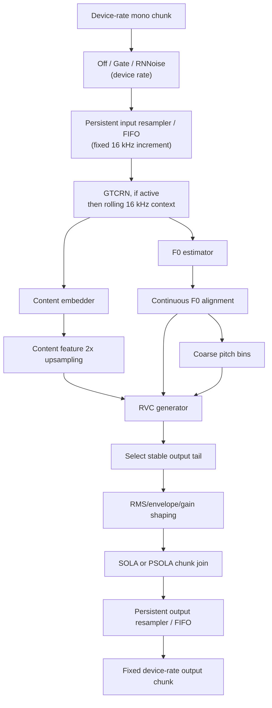

# Architecture

## Purpose

This document describes the conceptual architecture of `vc-rs`: how audio moves
through the realtime engine, how the RVC pipeline is staged, and why chunk
smoothing is separated from the audio callback. Concrete commands, local model
paths, and smoke-test recipes belong in `README.md` or local scripts instead.

CLI, GUI, VST3, and WAV conversion share the same audio-I/O-agnostic conversion
components wherever their hosting constraints permit. Front-ends adapt device,
host, or file I/O to those components; they should not own separate inference,
chunk-conversion, smoothing, or output-assembly implementations.

## Module Boundaries

- `vc-core`: shared audio-I/O-agnostic conversion components, including
  `RvcPipeline`, `ChunkConverter`, `convert_finite`, DSP, and SOLA/PSOLA smoothing.
- `vc-app`: shared standalone realtime runtime for CLI and GUI, including device
  I/O, bounded queues, worker orchestration, and metrics. The audio host is the
  `AudioHost` enum (cpal-`HostId`-aligned: `Wasapi`/`Asio`/`CoreAudio`/`Alsa`/`Jack`)
  and is chosen **per direction** (`input_host`/`output_host` in `RealtimeConfig`),
  so input and output may use different hosts — they are independent streams and
  clock domains, already resampled between by the engine. Every host except WASAPI
  *exclusive* goes through the shared cpal stream path (they differ only by which
  cpal host the device comes from); WASAPI exclusive uses the bespoke `wasapi_audio`
  path until cpal gains exclusive mode. Hosts unavailable on the running
  platform/build (e.g. ASIO without the `asio` feature) error at open time. cpal
  loads a single ASIO driver globally, so ASIO-on-both-directions shares one driver.
- `vc-cli`: CLI arguments, validation, realtime runtime control, and WAV file
  adaptation to the shared conversion components.
- `vc-gui`: GUI state and controls that configure the `vc-app` runtime.
- `vc-vst3`: DAW host adaptation, audio-callback ring-buffer I/O, worker
  scheduling, plugin state, and host latency reporting.

Changes to chunk sizing, model context, smoothing, or output latency usually
cross the front-end worker runtimes, `model_rvc`, `sola`, and `dsp`; review them
together.

## Shared Conversion Paths

All conversion modes should use the shared `vc-core` model and chunk-conversion
components. Inference, model streaming state, output shaping, and SOLA/PSOLA
joining must not be reimplemented in a front-end merely because its audio source
or scheduler differs.

CLI and GUI additionally share `vc-app` because both own standalone audio
devices. VST3 cannot use that device runtime because the DAW owns its audio
callback and requires plugin-specific state and latency reporting. VST3 should
still adapt host audio to the shared conversion components and keep its distinct
worker and buffering behavior narrowly scoped to host integration.

WAV conversion is an offline adapter around the same `RvcPipeline` and
`ChunkConverter` path used for realtime conversion. The shared core
`convert_finite` owns priming, partial-chunk padding, zero-input drain, and
content-delay removal. CLI code supplies file I/O and consumes the result;
it does not implement a second model or output-assembly path.

When a hosting constraint requires a front-end-specific behavior, document the
constraint near the implementation and preserve the shared path for all
unaffected stages.

## Realtime Topology

```mermaid
flowchart LR
    mic["Input device"] --> in_cb["Input audio callback"]
    in_cb --> in_ring["Input ring buffer"]
    in_ring --> worker["Worker thread"]
    worker --> model["RVC pipeline"]
    model --> smooth["SOLA / PSOLA smoother"]
    smooth --> resample["Persistent output resampler / FIFO"]
    resample --> out_ring["Output ring buffer"]
    out_ring --> out_cb["Output audio callback"]
    out_cb --> speaker["Output device"]
```

The audio callbacks are intentionally small. They move samples through bounded
ring buffers and emit silence on underrun; they do not run ONNX inference,
perform chunk smoothing, write files, or log directly. Anything that can block,
allocate heavily, or take model-scale CPU/GPU time is kept on the worker side.

CPAL error callbacks also run on the audio thread on some backends. They only
increment preallocated atomic counters by error category. The session control
thread logs accumulated counts at most once per second per category/direction,
and stream teardown drains the remaining counts after stopping callbacks.
Backend-specific error text is not retained; synchronous open/build errors
still include their original diagnostics. This keeps error storms bounded
regardless of the configured log level.

The threads carrying those callbacks run at OS real-time priority. The bespoke
WASAPI path and the worker self-boost via `thread-priority`; the cpal-driven
paths (WASAPI-shared, ASIO, …) get the same treatment from cpal's `realtime`
feature (enabled on the `cpal` dependency in `vc-app`), which promotes its
internal stream threads — Windows MMCSS "Pro Audio", else
`THREAD_PRIORITY_TIME_CRITICAL`. This pulls `audio_thread_priority` (MPL-2.0),
allowed crate-scoped in `deny.toml` since it ships unmodified and statically
linked.

The worker owns chunk accumulation, model inference, output smoothing,
resampling back to the device rate, and metrics updates. If inference falls
behind, bounded queues make the failure mode explicit: input overrun drops new
input samples, output underrun emits silence, and output overflow drops newly
produced samples rather than blocking the realtime callback.

Standalone sessions with a complete model set keep both RVC and passthrough
routes available on the worker. The live passthrough flag is sampled once per
input chunk. Passthrough stops invoking RVC inference and applies input gain,
the configured input denoiser, device-rate resampling, and output gain. When
conversion resumes, the worker clears stale RVC rolling context and smoother
history together with the input/output resamplers and denoiser state before
processing the next chunk. Model-free sessions expose only the passthrough route.

## Chunk Lifecycle

Realtime audio arrives in device callback-sized blocks, but the model operates
on larger logical chunks. The worker accumulates input samples until one model
chunk is available, then sends that chunk through the RVC pipeline.

RVC settings use whole 10 ms hops within the frontend's 20–2000 ms range.
`validation::RvcChunkTiming` validates the duration without rounding: each hop
must contain integer samples at the input, 16 kHz, model, and output rates.
25 ms is rejected; 20 or 30 ms is valid at 16/44.1/48 kHz, while 22.05 kHz
requires multiples of 20 ms. Validation first checks the configured duration,
then the device/file rates, and finally the native model rate when it is known.
Settings displayed in GUI/VST3 are not silently rounded to a different duration.
Model-free passthrough retains its existing arbitrary-duration behavior; a
complete model set still requires valid RVC timing when initially bypassed,
because that session can switch to conversion live.

`RvcPipeline` stores the validated input rate and hop at load time. Its public
`process` rejects a different rate or sample count before changing denoiser,
waveform, pitch, or generator state. A chunk/rate change therefore rebuilds the
pipeline and converter, including their fixed inference profiles and FIFOs.
Only a final offline partial chunk is padded to the loaded hop by `convert_finite`.

The RVC pipeline does not treat each chunk as isolated audio. It keeps streaming
state for recent input, 16 kHz resampled audio, content features, and F0 frames.
Each inference window includes the current chunk plus enough recent context and
extra output allowance for smoothing. The model output is then trimmed to the
tail that corresponds to the current chunk and the smoother search window.

ContentVec's 20 ms context alignment is separate from RVC's 10 ms hop. Aligning
the full inference window must not increase the amount by which the audio, F0,
`rnd`, or NSF timeline advances. For a validated hop,
`chunk_samples_16k == advance_frames * 160`; both feature/pitch state and waveform
history advance by that exact duration, including a 30 ms hop. This timing
contract does not by itself guarantee identical ContentVec features in the
overlap of windows shifted by an odd number of 10 ms frames.

This lifecycle preserves three invariants:

- The smoother commits one fixed model-rate hop; `ChunkConverter` resamples it
  into a fixed output-rate hop with exactly the same duration.
- Feature frames, continuous F0, coarse pitch, and model output must refer to
  the same time window.
- The realtime callback sees only queued samples, never model-domain state.

## RVC Pipeline

```mermaid
flowchart TD
    input["Device-rate mono chunk"] --> denoise["Off / Gate / RNNoise<br/>(device rate)"]
    denoise --> resample["Persistent input resampler / FIFO<br/>(fixed 16 kHz increment)"]
    resample --> state["GTCRN, if active<br/>then rolling 16 kHz context"]
    state --> embed["Content embedder"]
    state --> f0["F0 estimator"]
    embed --> feats["Content feature 2x upsampling"]
    f0 --> pitchf["Continuous F0 alignment"]
    pitchf --> coarse["Coarse pitch bins"]
    feats --> rvc["RVC generator"]
    pitchf --> rvc
    coarse --> rvc
    rvc --> tail["Select stable output tail"]
    tail --> level["RMS/envelope/gain shaping"]
    level --> join["SOLA or PSOLA chunk join"]
    join --> output_resample["Persistent output resampler / FIFO"]
    output_resample --> device["Fixed device-rate output chunk"]
```

Standalone RNNoise (48 kHz) runs at the **device rate**, after input gain and
before RMS/silence detection, ContentVec, and F0 extraction. Its fixed-delay
adapter preserves the input sample count for every worker call while retaining
recurrent and resampler state across chunks.

**GTCRN (16 kHz) is the exception to the device-rate rule.** It denoises the new
16 kHz increment *inside* `generate_input` — reusing the resample the pipeline
already does into `audio_16k_buffer`, before that increment is windowed — so the
realtime hot path pays no extra round-trip resample and the model sees native
16 kHz. It shares the same fixed-delay `FrameDenoiser` adapter as RNNoise (at
16 kHz the adapter's resamplers are bypass), preserves the per-call 16 kHz sample
count, and never shifts the feature/F0 grid. Because the cleaned signal now is the
one ContentVec/F0 consume, the RVC-path **input RMS, silence detection,
volume-envelope memory, and RMS-mix reference are all derived from that 16 kHz
timeline for every denoiser mode** (Off / Gate / RNNoise / GTCRN), not from the
raw device-rate buffer. The passthrough route keeps a separate device-rate GTCRN
instance (its resamplers engage). GTCRN ships in standalone packages: Windows ML
uses ORT CPU for the tiny graph, while TensorRT uses a native TensorRT engine so
the TensorRT package remains ORT-free. VST3 intentionally does not enable or ship
these optional core denoisers.

Conceptually, RVC conversion has three model-facing inputs:

- Content features describe what is being spoken while discarding much of the
  source speaker identity.
- F0/pitch describes the melody of voiced speech and supports pitch shifting.
- Speaker/model conditioning selects the target voice inside the RVC model.

The content embedder and F0 estimator operate on the same 16 kHz context window.
Content features are upsampled by repeating each frame twice, matching the RVC
pipeline convention that expands the content-feature frame rate before
generation. F0 is then length-matched to the resulting feature frame count and
kept both as continuous `pitchf` and quantized coarse pitch. Misaligning these
streams usually sounds like timing drift, pitch lag, or unstable consonants, so
frame-grid changes should be treated as audio-quality changes, not cleanup.

After generation, the output may be shaped by volume envelope, RMS mixing, and
manual or automatic gain. These operations happen before chunk joining so the
smoother compares and crossfades audio at the level that will actually be
played.

### Continuous resampling with fixed hops

Rubato can emit samples in bursts whose sizes differ from the logical RVC hop.
`dsp::FixedInputResampler` buffers that continuous output and supplies exactly the
validated 16 kHz increment to `RvcStreamState` on every call. Its FIFO starts
with one declared delay calculated from the loaded hop, covering filter startup
and incomplete FFT/input blocks across every reachable batch phase. It retains all excess output for later
hops; it never truncates a burst or inserts fresh silence to conceal an underrun.
An underrun is an error in the timing contract. Equal rates bypass resampling
and add no resampler delay.

After SOLA/PSOLA joins in the native model rate, `ChunkConverter` sends only the
committed, non-overlapping hop to its persistent `dsp::OutputResampler`.
Candidate search/crossfade margins must not be resampled again as new audio.
The output adapter retains filter and FIFO state across chunks, removes filter
startup once, and declares its fixed output-domain buffering delay. It requires
the model and output hops to have exactly equal rational durations. Resetting
this adapter per chunk, or appending a separately resampled overlap tail, breaks
the filter timeline and can create audible seams.

`dsp::resample_mono` uses the same output adapter with finite draining and one
startup-delay removal. It remains appropriate for isolated buffers such as the
RMS reference; the committed converted output uses the persistent adapter owned
by `ChunkConverter`.

The fixed-hop adapters keep the same FFT size, window and filter coefficients as
before. `dsp::fixed_hop` computes the smallest safe FIFO preload from the full
batch/FFT phase cycle. With input batch B, FFT input/output F/O, hop H/K, and
trimmed filter delay D, raw production after n calls is
`E(n) = floor(floor(n*H/B)*B/F)*O`. The required preload is
`D + max(n*K - E(n))` over `lcm(B,F)/gcd(H,lcm(B,F))` calls. A first-call-only
estimate fails for the generic Input mode at 44.1 kHz; its 30 ms hops have a
160-call cycle. Equal-rate
adapters still have zero delay. Fixed adapters reject any changed input or output
hop before consuming samples, even if the new hops have equal durations. The
generic append/finite adapter retains its conservative, arbitrary-length bound.
At 48 kHz input / 16 kHz model input, valid 10 ms-grid hops now retain 80 samples
(5 ms), instead of the former 400 (25 ms).

The fixed model-input adapter now selects `FixedSync::Both` with the same 480
hint, one sub-chunk and `BlackmanHarris2` window. This preserves the actual FFT
and filter, while feeding their natural block directly: 44.1 kHz -> 16 kHz uses
882 -> 320 frames rather than an extra 480-frame batching stage. A 200 ms hop
there retains 160 output samples (10 ms), down from 480 (30 ms) with the former
fixed-hop Input adapter. The 48 kHz hold remains 5 ms. Do not globally switch
`StreamingResampleMono::new`: its Input-mode contract is still used by generic
denoiser and passthrough adapters. Stream rate/hop changes rebuild the fixed-hop
resampler and all model histories together; `ContentDelay` propagates its new
retention through WAV trimming and host latency reporting.

RMS references use `dsp::ResampleMonoScratch` owned by `RvcStreamState`. It reuses
FFT plans and allocated storage but resets the filter/FIFO for each independent
window, preserving finite trim/drain behavior. These reference windows overlap:
carrying signal history across calls would duplicate content and change the
gain envelope. Only committed joined output uses a continuous filter timeline.

### Generator time state (`rnd` noise, NSF phase, `nsf_noise`)

Some RVC exports take time-varying noise/phase as graph inputs rather than
sampling them internally. Because the worker feeds an **overlapping** rolling
window, a given absolute frame recurs across consecutive chunks; if those frames
saw fresh noise each chunk the overlapping region would differ and the SOLA join
would degrade. `model_rvc/time_state.rs` (`RvcTimeState`) keeps this state on the
CPU, backend-neutrally — every backend (ORT CPU/CUDA/DirectML and native
TensorRT) only *binds* the buffers it produces, so there is one noise/phase
timeline regardless of provider. State is plain `Vec<f32>`/scalars today, behind a
`roll`/`window_into` surface, so it can later move to a GPU-resident buffer
without touching callers.

- **Latent noise (`rnd`)** — for RVC WebUI / converter exports that expose the
  VITS reparameterization noise `z`. A rolling buffer is advanced in lockstep with
  `pitchf_buffer` (same new-frame count, same window length, same 10 ms grid). The
  per-chunk `[1, channels, feature_len]` tensor is selected with the *same*
  center-crop + tail alignment the pipeline applies to `pitchf`, so `rnd` frame
  *i* lines up with `pitchf`/`feats` frame *i* and overlapping absolute frames
  read identical noise across chunks. A fixed seed plus a fixed chunk sequence is
  byte-reproducible.

- **Streaming exports (rvc-onnx-web, `rvc.export_mode == "streaming"`)** add two
  more inputs, detected from `rvc.*` metadata + I/O names (`onnx_meta`):
  - **`nsf_noise` `[1, audio_len, 1]`** — per-output-sample NSF source noise,
    rolled on the output-sample grid (`* frame_hop`) with the same alignment as
    `rnd` (distinct seed, so it is independent of `rnd`).
  - **NSF phase (`phase_in` `[1,1,1]` → `streaming_nsf_phase` `[1, audio_len, 1]`)**
    — `phase_in` is the normalized phase before the window's first sample increment.
    vc-rs feeds *overlapping* windows, so a naive carry of the last sample's phase
    is wrong. The current export emits the per-sample `streaming_nsf_phase`, and
    each output element already includes that sample's phase increment. The next
    window starts `N = advance_frames * frame_hop` samples into this output, so
    `streaming_nsf_phase[N - 1]` is the next `phase_in`; selecting element `N`
    would add an extra sample's increment every chunk. Zero advance retains the
    existing phase. The host
    reads the output back and picks it ([`set_phase_from_output`]). For an earlier
    export that emitted only a scalar phase (or none), it falls back to CPU
    accumulation: advance the window-start phase past the frames the window scrolls
    using this chunk's `pitchf` (`phase += Σ f0/sample_rate * frame_hop`, wrapped),
    which reproduces the model's per-frame step.

  Streaming runs on the dynamic-shape ORT path (CPU/CUDA/DirectML), on
  **native TensorRT**, and on the **Windows ML TensorRT-RTX** pinned-CPU
  IoBinding (`windowsml-nvtrtx`). The fixed-shape profile adds `nsf_noise`
  `[1, feature_len*frame_hop, 1]` (the `phone_lengths`/`sid` axes are dynamic in
  the streaming export, so they join the build profile too) and `phase_in`
  `[1,1,1]`; native TensorRT's shim and the ORT pinned IoBinding both bind those
  inputs by name and copy the `streaming_nsf_phase` output back to the host
  (`RvcTensorRtPinnedBinding` for the ORT path). The *CUDA-graph* IoBinding does
  not model the extra I/O and fails clearly at load — use one of the above.

  - **NvTensorRtRtx runtime-cache caveat.** The TensorRT-RTX EP writes its
    runtime cache file when the session is destroyed, and for streaming engines
    that on-destroy write fast-fails the process (`0xC0000409`, in
    `trt_rtx_ep::utils::WriteFile` — an EP-side teardown bug, independent of our
    IoBinding; the dynamic `session.run` path crashes the same way, and the
    inference output itself is correct). vc-rs therefore omits
    `nv_runtime_cache_path` for streaming RVC sessions only (`load_session`'s
    `disable_nvtrtx_runtime_cache`, set from `io_names.nsf_noise.is_some()`), so
    those engines rebuild each load but tear down cleanly. Non-streaming
    `windowsml-nvtrtx` keeps the cache.

- **Reset.** Resuming conversion after passthrough invokes both
  `RvcPipeline::reset_streaming_state` and
  `ChunkConverter::reset_streaming_state`. The pipeline resets its denoisers and
  rebuilds `RvcStreamState` at the loaded input rate, clearing waveform/F0
  history and the fixed input FIFO, re-seeding noise, and zeroing NSF phase and
  absolute position. The converter clears the smoother and output filter/FIFO
  together. Sample-rate or chunk changes instead require a newly loaded
  pipeline and converter; they cannot be applied by passing a new rate to the
  public `process` method. The private `generate_input` rate-configuration path
  is not a frontend reconfiguration mechanism. Model reload and stream restart
  likewise begin fresh timelines. Models without noise/phase inputs still
  require the waveform, denoiser, and output-state resets.

## SOLA

SOLA, Similarity Overlap-Add, is used to hide discontinuities between
independently generated chunks. Even when two chunks represent adjacent input
audio, the generated waveform can be shifted by a few samples at the boundary.
Naively concatenating those chunks can produce clicks, combing, or a rough
phasiness.

The smoother keeps a short tail from the previous emitted chunk as a reference.
For the next generated candidate, the worker asks the model for extra samples
around the boundary. SOLA searches within that extra range for the offset whose
overlap is most similar to the reference, cuts the candidate at that offset, and
crossfades the overlap. The emitted chunk length stays fixed; only the boundary
position inside the candidate moves.

SOLA must stay on the worker side. It needs model-output history, extra model
samples, correlation search, and crossfade buffers. Moving it into the audio
callback would put search work and allocation pressure on the realtime path.

## PSOLA

PSOLA, Pitch-Synchronous Overlap-Add, is the pitch-aware variant used here when
the current output has stable voiced F0. Instead of accepting any high-similarity
offset, it estimates the current pitch period from `pitchf` and prefers offsets
that align the overlap near pitch-period boundaries.

This is useful for sustained vowels and other voiced regions, where a boundary
that cuts across the waveform period can sound unstable even if the generic
SOLA score is acceptable. When F0 is missing, unvoiced, too unstable, or outside
the supported range, PSOLA falls back to normal SOLA. That fallback is important:
forcing pitch-synchronous alignment on noisy consonants or silence usually makes
the boundary worse.

## Latency Trade-offs

End-to-end latency is the sum of device buffering, input chunk accumulation,
model inference time, smoothing/search allowance, output buffering, and any
resampling delay. Reducing one term often increases pressure elsewhere.

`ContentDelay` represents retained audio time as an exact rational duration.
`RvcPipeline::input_content_delay` combines device-rate denoiser delay with the
16 kHz input-adapter/GTCRN delay in their native sample domains.
`ChunkConverter::output_content_delay_samples` adds the model-domain join hold
before rounding up once on the output grid, then adds the already integral
output-resampler delay. Rounding each component separately can remove an extra
real sample at rates such as 44.1 kHz. Input context padding and inference wall
time are not content delay; a denoiser delay already compensated by offline
preprocessing must not be counted again.

The join hold uses the actual capped crossfade, search allowance, and tail
discard; with crossfade disabled only tail discard remains. SOLA/PSOLA can
advance the selected content within the search window, so this hold is a
nominal bound rather than an exact source-time mapping for every chunk.
An unprimed smoother's first silent output hop is separate startup behavior.
`ChunkStats::processing_time` includes the model, join and output resampler;
the standalone telemetry additionally times live updates and resume resets on
the worker. The legacy inference time remains the model pipeline's existing
measurement. `content_delay_samples` is optional until the converter initializes,
and is unknown on standalone passthrough (whose variable-burst adapter does not
declare a fixed content delay). CLI/GUI present this nominal content hold
separately from processing time: neither is a measured device-to-device latency.
VST3 initially reports a buffering estimate and, after the converter's first
successful chunk determines the model rate and resampler delays, reports one
input hop plus the shared converter's content delay. The callback only relays
the worker's precomputed atomic value to the host.

Smaller chunks reduce chunking latency but increase scheduling overhead and make
the model pipeline more sensitive to inference spikes. Larger chunks are easier
for the model and smoother but add startup and interactive latency. Extra model
output gives SOLA/PSOLA more room to find a clean join, but it also increases
the amount of audio processed per chunk.

The architecture therefore treats latency-sensitive code as a boundary:
callbacks are realtime-safe sample movers, while the worker is the only place
that may spend time on inference, smoothing, diagnostics, and file-oriented
debug output.

## WAV Mode

WAV conversion passes a fresh `ChunkConverter` to the shared `convert_finite`.
For nonempty input this helper primes the model/smoother with one zero hop,
pads the final partial input hop, and continues normal `process_chunk` calls
with zero input until the retained source interval has emerged. Fixed-length
output from the last real-input call does not prove that the tail has drained.
The loop bound comes from the declared content delay and target duration,
not silence detection, because a voice model may generate sound for zero input.

The helper then removes the declared startup content delay once and returns
`ceil(input_samples * output_hop / input_hop)` samples. Thus padding and drain
calls do not lengthen the written clip; CLI WAV input and output rates match,
so the saved sample count equals the source count. Empty input returns empty
without priming. The helper takes ownership of the converter, preventing callers
from resuming that stream after its finite drain.

WAV RNNoise preprocessing uses its own finite adapter to drain and remove its
delay before RVC, and that compensated delay is excluded from the subsequent
pipeline. GTCRN remains on the shared 16 kHz RVC seam, so `convert_finite`
drains its delay together with the input/output resamplers and smoother.

Finite join diagnostics map each join to the final cropped WAV, including the
output-resampler delay; seam positions need not be chunk-size multiples.
Startup joins outside the retained clip are omitted, while zero-input drain
calls may contain real speech and contribute report entries. SOLA search can
shift local waveform timing within its allowance; exact output duration and
drain coverage do not imply sample-exact reconstruction through that search.
Differences from realtime output should follow from priming, buffering,
scheduling, or finalization, not a separate inference or smoothing path.
