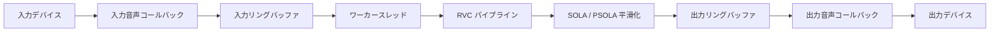
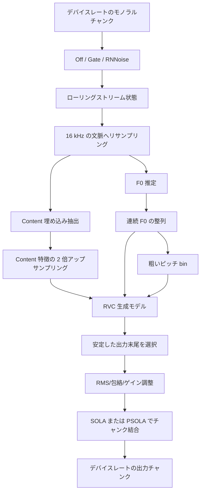

# アーキテクチャ

## 目的

このドキュメントは `vc-rs` の概念レベルのアーキテクチャを説明します。
具体的には、リアルタイムエンジン内で音声がどのように流れるか、RVC
パイプラインがどの段階に分かれているか、チャンク平滑化を音声コールバック
から分離している理由を扱います。具体的なコマンド、ローカルのモデルパス、
スモークテスト手順は `README.md` またはローカルスクリプト側に置きます。

現在の設計は、リアルタイム RVC 音声変換を行う CLI ファーストの Rust
実装です。将来 GUI を追加する場合も、同じエンジンとモデルパイプラインを
再利用できる形を保ちます。GUI はエンジンを設定する立場に置き、音声 I/O
や推論ロジックを直接所有しない方針です。

## モジュール境界

- `cli`: ユーザー向け引数とバリデーション。
- `audio`: デバイス列挙と CPAL/WASAPI ストリーム設定。
- `engine`: リアルタイムストリームの統括、境界付きキュー、ワーカースレッド、
  メトリクス、WAV モードでの同一モデル経路の再利用。
- `model_rvc`: ONNX Runtime セッション、ストリーミング RVC 状態、
  特徴抽出、F0 抽出、ピッチ準備、出力レベル調整。
- `sola`: SOLA または PSOLA によるチャンク結合とモデル出力の準備。
- `dsp`: リサンプリング、サンプル変換、RMS/包絡処理、相関計算、
  クロスフェードの基本処理。

チャンクサイズ、モデル文脈、平滑化、出力レイテンシを変更する場合は、
多くの場合 `engine`、`model_rvc`、`sola`、`dsp` をまとめて確認する必要が
あります。

## リアルタイム構成

音声コールバックは意図的に小さく保ちます。境界付きリングバッファを通じて
サンプルを移動し、アンダーラン時には無音を出力します。ONNX 推論、チャンク
平滑化、ファイル書き込み、直接のログ出力は行いません。ブロックする可能性が
ある処理、大きな割り当てを伴う処理、CPU/GPU 時間を大きく使うモデル処理は
ワーカー側に置きます。

ワーカーは、チャンク蓄積、モデル推論、出力平滑化、デバイスサンプルレート
への再リサンプリング、メトリクス更新を担当します。推論が追いつかない場合、
境界付きキューにより失敗の形が明確になります。入力オーバーランでは新しい
入力サンプルが落ち、出力アンダーランでは無音が出力され、出力バッファが
あふれた場合はリアルタイムコールバックを止めずに新しく生成されたサンプルを
落とします。

## チャンクのライフサイクル

リアルタイム音声はデバイスのコールバックサイズ単位で届きますが、モデルは
より大きな論理チャンク単位で動作します。ワーカーはモデルチャンク 1 個分の
入力サンプルがそろうまで蓄積し、そのチャンクを RVC パイプラインへ送ります。

RVC パイプラインは各チャンクを孤立した音声として扱いません。直近の入力音声、
16 kHz にリサンプリングした音声、content 特徴、F0 フレームをストリーミング
状態として保持します。各推論窓には現在のチャンクに加えて、必要な直近文脈と
平滑化用の追加出力余裕が含まれます。モデル出力は、現在のチャンクと
スムーザーの探索窓に対応する末尾部分へトリミングされます。

このライフサイクルでは、次の不変条件を守ります。

- 出力スムーザーは、入力チャンク 1 個につき固定長のデバイスレートサンプルを
  出力する。
- 特徴フレーム、連続 F0、粗いピッチ、モデル出力は同じ時間窓を指す。
- リアルタイムコールバックが見るのはキュー済みサンプルだけであり、
  モデル領域の状態を直接扱わない。

## RVC パイプライン

スタンドアロン版のRNNoiseは入力ゲイン後、RMS/無音判定・ContentVec・F0抽出前に
実行します。固定遅延アダプターはワーカー呼び出しごとの入力サンプル数を維持し、
RNNoiseとリサンプラーの状態をチャンク間で継続します。VST3はこのoptional core
featureを有効化・配布しません。

概念的には、RVC 変換には 3 種類のモデル入力があります。

- Content 特徴は、元話者らしさの多くを落としつつ、何が発話されているかを
  表します。
- F0/ピッチは、有声音のメロディを表し、ピッチシフトにも使われます。
- 話者またはモデル条件は、RVC モデル内のターゲット声質を選びます。

Content 埋め込み抽出器と F0 推定器は、同じ 16 kHz の文脈窓に対して動きます。
Content 特徴は各フレームを 2 回ずつ反復してアップサンプリングします。これは
生成前に content 特徴のフレームレートを広げる RVC パイプライン上の慣例です。
その後、F0 はこの特徴フレーム数に長さを合わせ、連続値の `pitchf` と
量子化された粗いピッチの両方として保持されます。これらの流れがずれると、
タイミングのずれ、ピッチの遅れ、不安定な子音として聞こえやすいため、
フレームグリッドの変更は単なる整理ではなく音質変更として扱う必要があります。

生成後の出力には、音量包絡、RMS ミックス、手動または自動ゲインを適用できます。
これらはチャンク結合の前に行います。スムーザーが比較しクロスフェードする音声を、
実際に再生される音量状態と一致させるためです。

## SOLA

SOLA、Similarity Overlap-Add は、独立に生成されたチャンク間の不連続を隠すために
使います。隣接する入力音声に対応するチャンクであっても、生成された波形は境界で
数サンプルずれることがあります。そのまま連結すると、クリック、コムフィルタ的な
響き、ざらついた位相感として聞こえることがあります。

スムーザーは、前回出力したチャンクの短い末尾を参照として保持します。次の生成候補
については、境界付近に追加サンプルが得られるようにモデルへ余分な出力を要求します。
SOLA はその追加範囲内で、参照との重なりが最も似ているオフセットを探し、その位置で
候補を切り出して重なり部分をクロスフェードします。出力チャンク長は固定のままで、
候補内の境界位置だけが移動します。

SOLA はワーカー側に置く必要があります。モデル出力の履歴、追加モデルサンプル、
相関探索、クロスフェード用バッファを必要とするためです。これを音声コールバックへ
移すと、リアルタイム経路に探索処理と割り当て圧が入ってしまいます。

## PSOLA

PSOLA、Pitch-Synchronous Overlap-Add は、現在の出力に安定した有声 F0 がある場合に
使うピッチ同期版です。高い類似度を持つ任意のオフセットをそのまま採用するのではなく、
`pitchf` から現在のピッチ周期を推定し、重なりがピッチ周期境界付近でそろう
オフセットを優先します。

これは、持続母音などの有声区間で有効です。このような区間では、汎用 SOLA の
スコアが十分に見えても、波形周期をまたぐ境界で切ると不安定に聞こえることが
あります。F0 が存在しない、無声音である、不安定すぎる、または対応範囲外の場合は、
PSOLA は通常の SOLA にフォールバックします。このフォールバックは重要です。雑音的な
子音や無音に対してピッチ同期を強制すると、境界がかえって悪化しやすいためです。

## レイテンシのトレードオフ

エンドツーエンドのレイテンシは、デバイスバッファ、入力チャンク蓄積、
モデル推論時間、平滑化/探索余裕、出力バッファ、リサンプリング遅延の合計です。
どれか 1 つを小さくすると、別の部分への負荷が増えることがあります。

小さいチャンクはチャンク由来の遅延を下げますが、スケジューリングの頻度を増やし、
推論スパイクの影響を受けやすくします。大きいチャンクはモデルとスムーザーには
扱いやすい一方、起動時や対話時のレイテンシを増やします。追加モデル出力は
SOLA/PSOLA がきれいな接続点を見つける余地を増やしますが、チャンクごとに処理する
音声量も増やします。

そのため、このアーキテクチャではレイテンシに敏感なコードを境界として扱います。
コールバックはリアルタイム安全なサンプル移動だけを担当し、推論、平滑化、診断、
ファイル向けデバッグ出力に時間を使えるのはワーカーだけです。

## WAV モード

WAV 変換は、リアルタイム変換と同じ RVC パイプラインとスムーザーを使います。
これにより、デバイススケジューリングの揺らぎを除いて、音質変更を決定的に
テストできます。WAV モードではコールバック期限に制約されないため、スムーザーの
プライム処理や最終末尾の扱いを明示的に行えます。WAV とリアルタイム出力の差は、
通常、別のモデル経路ではなく、バッファリング、スケジューリング、最終末尾処理に
よって説明されるべきです。
